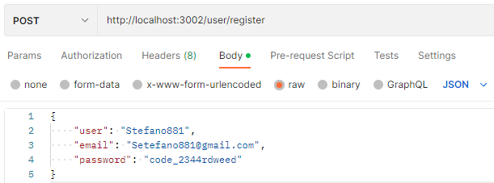
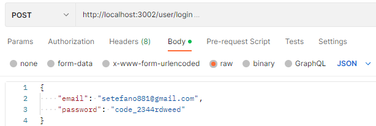

# How to start the server
Before start the server locally or run the test, it's fundamental install MongoDB.  
To start the server (in this case on port 3002) use the command: ```npm start```.  
To execute the tests use the command: ```npm test```.  
To execute the server in dev mode: ```npm run dev```.  

# Overview of the project
The project is structured in 2 main parts: 
- the web server implemented in NodeJS.
- the NoSQL database (MongoDB)  

The web server exposes REST APIs that allow a new user to register, and every user can add one or more universities. Once the  
user is registered, it's possible to login with the credentials (email and password). JWT is used for the authorization of the REST API.    
Let's do a pratical example using Postman:

1. start the server
2. Sign in  
     
   In this post request the username, email and password of the new user is passed in the body. The email has to be a valid
   email, and the password has to have at least 7 characters otherwise an error is returned.
   Once the post request is completed, a new user is stored in the collection "users" in the MongoDB database, as shown in the image below:  
     
   As we can see in the db, the user with the password specified in the request is not stored and the value of the property "password" is  
   the encrypted version of the password.  
   Furthermore, we can see that the property "token" was added. This property will be useful in the next steps.
3. Login of the user  
     
   In this post request the credentials of the user (email and password) are passed. If these credentials are correct a new token is added in  
   the property "token" of the user stored in the db, as in the image below:  
   
4. Modify the user  
   Before call this API, like all the other APIs (except the sign-in, and the login APIs), it's important to modify the header of the  
   request so that it's possible to perform the authorization.
   To do this let's add the token generated with the login in the header Authorization:  
       
   In the body are defined the changes of the user that will be performed.
   
5. Add a university  
   Like we said in the previous step, to perform this request is fundamental to add the header "Authorization" with the token generated from the login.  
     
   In this case 2 universities will be saved in the db and these 2 universities are associated to the user created in the second step.
6. Logout  
   Like we said in step 4, to perform this request is fundamental to add the header "Authorization" with the token generated from the login.  
     
   Once the post request is performed the token stored in the "token" property inside the document is deleted.  
 7. Delete user  
    Like we said in the step 4, to perform this request is fundamental to add the header "Authorization" with the token generated from the login.  
      
    When the user is deleted, all the universities linked to the user are, also, deleted.
